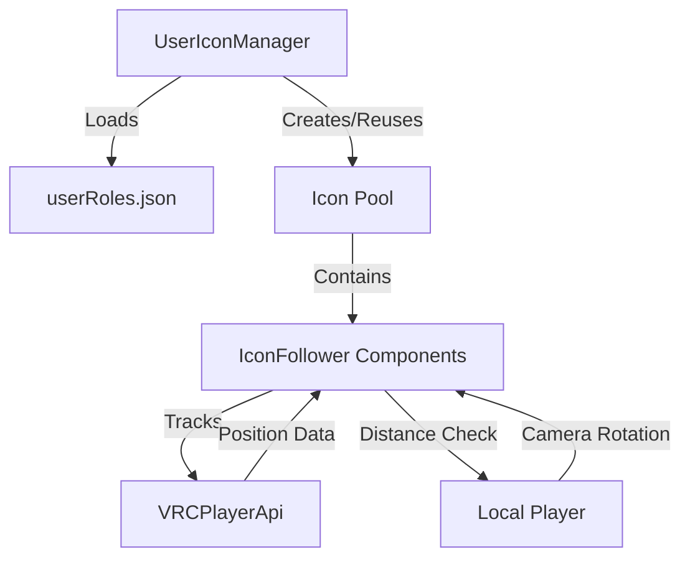
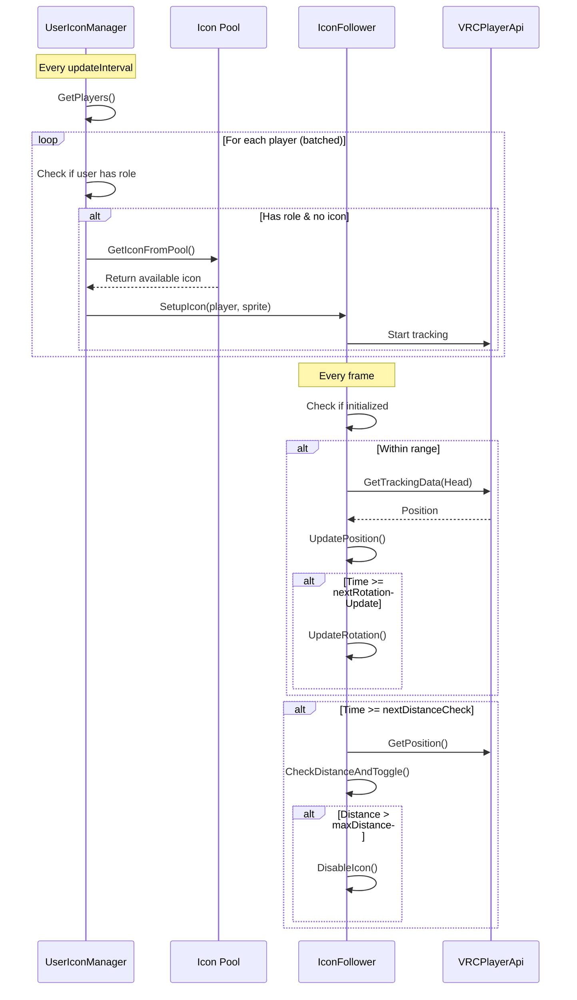

## System Architecture

VRChat Role Icons uses a two-component architecture that efficiently manages role-based icons for players in your VRChat world.



## Core Components

### UserIconManager

The central manager responsible for:
- Loading role data from JSON
- Mapping users to roles based on display names
- Managing the icon object pool
- Assigning icons to players
- Handling player join/leave events

**Key file:** `UserIconManager.cs`

### IconFollower

The component attached to each icon GameObject that handles:
- Following the target player's head position
- Billboard rotation toward local player's camera
- Distance-based visibility toggling
- Optimized update loops

**Key file:** `IconFollower.cs`

## System Lifecycle

<Steps>
  <Step title="Initialization">
    When the scene starts, `UserIconManager.Start()` initializes the system:
    
    ```csharp
    void Start()
    {
        InitializeSystem();
        LoadRolesFromJson();
        SendCustomEventDelayedSeconds(nameof(UpdatePlayerIcons), 2f);
    }
    ```
    
    This creates the icon pool, initializes data structures, and validates configuration.
    
    **Reference:** `UserIconManager.cs:48-53`
  </Step>

  <Step title="JSON Loading">
    The system loads role data using VRChat's String Downloader:
    
    ```csharp
    public void LoadRolesFromJson()
    {
        if (rolesJsonUrl != null)
        {
            VRCStringDownloader.LoadUrl(rolesJsonUrl, (IUdonEventReceiver)this);
        }
    }
    ```
    
    Upon successful load, `OnStringLoadSuccess()` parses the JSON and builds a user-to-role mapping.
    
    **Reference:** `UserIconManager.cs:152-159`, `UserIconManager.cs:161-181`
  </Step>

  <Step title="Player Detection">
    The system continuously monitors for players in the world:
    
    - **On Join:** `OnPlayerJoined()` triggers a delayed icon assignment
    - **Periodic Updates:** Every `updateInterval` seconds (default: 60s), the system scans all players
    - **Batched Processing:** If enabled, processes `playersPerBatch` players per frame to distribute CPU load
    
    **Reference:** `UserIconManager.cs:468-483`, `UserIconManager.cs:112-150`
  </Step>

  <Step title="Icon Assignment">
    For each player with a role, the system:
    
    1. Checks if the player's display name matches any user in the role data
    2. Gets the appropriate role sprite based on role name
    3. Retrieves an icon from the pool (or creates one if under limit)
    4. Calls `IconFollower.SetupIcon()` to configure the icon
    
    ```csharp
    private void CreateOrReuseIcon(VRCPlayerApi player, string roleName)
    {
        Sprite roleSprite = GetRoleSprite(roleName);
        GameObject icon = GetIconFromPool();
        
        if (icon == null && poolSize < maxIconPool)
        {
            icon = CreateNewIcon();
        }
        
        IconFollower follower = icon.GetComponent<IconFollower>();
        follower.SetupIcon(player, roleSprite);
        icon.SetActive(true);
        
        activeIcons[player.playerId.ToString()] = icon;
    }
    ```
    
    **Reference:** `UserIconManager.cs:305-350`
  </Step>

  <Step title="Icon Tracking">
    Once assigned, `IconFollower.Update()` runs every frame to:
    
    1. **Position Update** (every frame if within range):
       ```csharp
       private void UpdatePosition()
       {
           Vector3 targetPos = GetTargetPlayerPosition();
           if (targetPos.magnitude > 0.1f)
           {
               cachedTransform.position = targetPos;
           }
       }
       ```
    
    2. **Rotation Update** (~30 FPS):
       ```csharp
       if (Time.time >= nextRotationUpdate)
       {
           UpdateRotation();
           nextRotationUpdate = Time.time + rotationUpdateInterval;
       }
       ```
    
    3. **Distance Check** (every 0.5s):
       ```csharp
       if (Time.time >= nextDistanceCheck)
       {
           CheckDistanceAndToggle();
           nextDistanceCheck = Time.time + distanceCheckInterval;
       }
       ```
    
    **Reference:** `IconFollower.cs:54-85`, `IconFollower.cs:87-117`, `IconFollower.cs:119-145`
  </Step>

  <Step title="Object Pooling">
    When a player leaves or loses their role:
    
    1. The icon is removed from `activeIcons` dictionary
    2. `IconFollower.CleanupIcon()` resets the component state
    3. The GameObject is deactivated and returned to the pool
    4. The pool slot is marked as available (`poolInUse[i] = 0`)
    
    ```csharp
    private void ReturnIconToPool(GameObject icon)
    {
        IconFollower follower = icon.GetComponent<IconFollower>();
        if (follower != null)
        {
            follower.CleanupIcon();
        }
        
        icon.SetActive(false);
        
        for (int i = 0; i < poolSize; i++)
        {
            if (iconPool[i] == icon)
            {
                poolInUse[i] = 0;
                break;
            }
        }
    }
    ```
    
    **Reference:** `UserIconManager.cs:382-403`
  </Step>
</Steps>

## Distance-Based Visibility

Icons automatically toggle visibility based on distance to optimize performance:

<Accordion title="How Distance Checks Work">
  The `IconFollower` checks distance at intervals (default: 0.5s) instead of every frame:
  
  ```csharp
  private void CheckDistanceAndToggle()
  {
      currentDistance = Vector3.Distance(
          localPlayer.GetPosition(), 
          GetTargetPlayerPosition()
      );
      
      bool shouldBeActive = currentDistance <= maxDistance;
      
      if (shouldBeActive != isWithinRange)
      {
          isWithinRange = shouldBeActive;
          
          if (isWithinRange)
              EnableIcon();
          else
              DisableIcon();
      }
  }
  ```
  
  **Benefits:**
  - Reduces distance calculations from 60/sec to 2/sec per icon
  - **96% reduction** in distance check CPU usage
  - Smooth transition between visible/hidden states
  
  **Reference:** `IconFollower.cs:119-145`
</Accordion>

<Info>
  When an icon is out of range, only the `SpriteRenderer` is disabled - the GameObject remains active to continue distance checks. This allows icons to smoothly reappear when players move closer.
</Info>

## Billboard Rotation System

Icons always face the local player's camera using optimized rotation updates:

<Tabs>
  <Tab title="Y-Axis Locked (Default)">
    ```csharp
    if (lockYAxis)
    {
        lookDirection.y = 0;
        Vector3 euler = playerHeadRotation.eulerAngles;
        euler.x = 0;
        euler.z = 0;
        cachedTransform.rotation = Quaternion.Euler(euler);
    }
    ```
    
    Icons remain upright and only rotate on the Y-axis, creating a stable billboard effect.
    
    **Reference:** `IconFollower.cs:104-110`
  </Tab>
  
  <Tab title="Full Rotation">
    ```csharp
    else if (lookDirection.magnitude > 0.01f)
    {
        cachedTransform.rotation = Quaternion.LookRotation(lookDirection);
    }
    ```
    
    Icons fully orient toward the camera, useful for 3D icons or special effects.
    
    **Reference:** `IconFollower.cs:112-115`
  </Tab>
</Tabs>

<Tip>
  Rotation updates run at ~30 FPS (`rotationUpdateInterval = 0.033f`) instead of 60 FPS, cutting rotation calculations in half with no visible quality loss.
</Tip>

## Update Flow Diagram



## Performance Characteristics

<CardGroup cols={2}>
  <Card title="Efficient Pooling" icon="recycle">
    - Maximum of 20 concurrent icons (configurable)
    - Zero GameObject allocation after pool warmup
    - Instant icon assignment from pool
  </Card>
  
  <Card title="Smart Updates" icon="gauge-high">
    - Position: 60 FPS (only when visible)
    - Rotation: 30 FPS (50% reduction)
    - Distance: 2 FPS (96% reduction)
  </Card>
  
  <Card title="Batched Processing" icon="layer-group">
    - Processes 10 players per frame by default
    - Distributes CPU load across multiple frames
    - Prevents frame-rate spikes
  </Card>
  
  <Card title="Distance Culling" icon="eye-slash">
    - Icons beyond maxDistance (50m default) are hidden
    - Invisible icons skip position/rotation updates
    - Automatic re-enable when back in range
  </Card>
</CardGroup>

## JSON Update Cycle

The role data is periodically reloaded to support dynamic role changes:

```csharp
private const float JSON_UPDATE_INTERVAL = 300f; // 5 minutes

void Update()
{
    if (Time.time >= nextJsonUpdateTime)
    {
        LoadRolesFromJson();
        nextJsonUpdateTime = Time.time + JSON_UPDATE_INTERVAL;
    }
}
```

This allows you to update roles on your remote server without restarting the VRChat world.

**Reference:** `UserIconManager.cs:41`, `UserIconManager.cs:104-108`

<Note>
  The system automatically reassigns icons when role data changes, ensuring players always display their current role.
</Note>
