## Overview

VRChat Role Icons implements multiple optimization techniques to handle **80+ concurrent players** with minimal CPU usage. These optimizations reduce update calls by up to **96%** compared to naive implementations.

## Performance Impact

### Before vs. After

<CardGroup cols={2}>
  <Card title="Before Optimization" icon="triangle-exclamation" color="#ef4444">
    **80 players scenario:**
    - 80 icons × 60 FPS = **4,800 Update() calls/sec**
    - All icons active simultaneously
    - No GameObject reuse
    - Constant CPU load
    - High memory churn
  </Card>
  
  <Card title="After Optimization" icon="circle-check" color="#22c55e">
    **80 players scenario:**
    - Only visible icons update fully
    - Object pooling with reuse
    - Batched updates across frames
    - **~70% reduction** in CPU usage
    - Stable memory footprint
  </Card>
</CardGroup>

### Performance Metrics

| Metric | Unoptimized | Optimized | Improvement |
|--------|-------------|-----------|-------------|
| Update() calls/sec | 4,800 | ~1,200 | **-75%** |
| Distance checks/sec | 4,800 | 160 | **-96%** |
| Active GameObjects | 80 | 20 max | **-75%** |
| Memory usage (MB) | ~15 | ~5 | **-66%** |
| CPU usage | High | Low | **-70%** |

**Reference:** `README.md:139-150`

## Object Pooling System

The pooling system eliminates expensive `Instantiate()` and `Destroy()` operations by reusing icon GameObjects.

### How It Works

<Steps>
  <Step title="Pool Initialization">
    On startup, the system creates empty pool arrays:
    
    ```csharp
    [SerializeField] private int maxIconPool = 20;
    
    private GameObject[] iconPool;
    private int[] poolInUse; // 0 = free, 1 = in use
    private int poolSize = 0;
    
    private void InitializeSystem()
    {
        iconPool = new GameObject[maxIconPool];
        poolInUse = new int[maxIconPool];
    }
    ```
    
    **Reference:** `UserIconManager.cs:21`, `UserIconManager.cs:34-36`, `UserIconManager.cs:61-62`
  </Step>
  
  <Step title="First Use: Create New">
    When an icon is needed and the pool is empty:
    
    ```csharp
    private GameObject CreateNewIcon()
    {
        if (iconPrefab == null || poolSize >= maxIconPool) 
            return null;
        
        GameObject newIcon = Instantiate(iconPrefab);
        if (newIcon != null)
        {
            iconPool[poolSize] = newIcon;
            poolInUse[poolSize] = 1;
            poolSize++;
            newIcon.SetActive(false);
            return newIcon;
        }
        
        return null;
    }
    ```
    
    Icons are created **lazily** - only when needed, up to `maxIconPool` limit.
    
    **Reference:** `UserIconManager.cs:365-380`
  </Step>
  
  <Step title="Reuse from Pool">
    When requesting an icon, check for available slots first:
    
    ```csharp
    private GameObject GetIconFromPool()
    {
        for (int i = 0; i < poolSize; i++)
        {
            if (poolInUse[i] == 0 && iconPool[i] != null)
            {
                poolInUse[i] = 1;
                return iconPool[i];
            }
        }
        return null; // Pool exhausted
    }
    ```
    
    **Reference:** `UserIconManager.cs:352-363`
  </Step>
  
  <Step title="Return to Pool">
    When a player leaves or loses their role:
    
    ```csharp
    private void ReturnIconToPool(GameObject icon)
    {
        if (icon == null) return;
        
        // Clean up the icon state
        IconFollower follower = icon.GetComponent<IconFollower>();
        if (follower != null)
        {
            follower.CleanupIcon();
        }
        
        icon.SetActive(false);
        
        // Mark pool slot as available
        for (int i = 0; i < poolSize; i++)
        {
            if (iconPool[i] == icon)
            {
                poolInUse[i] = 0;
                break;
            }
        }
    }
    ```
    
    **Reference:** `UserIconManager.cs:382-403`
  </Step>
</Steps>

### Pool Benefits

<AccordionGroup>
  <Accordion title="Eliminates Instantiate() Overhead">
    `Instantiate()` is expensive in Unity, especially with complex prefabs:
    
    - **Without pooling:** Create new GameObject on every player join
    - **With pooling:** Reuse existing GameObject, just reconfigure it
    
    **Benchmark:** 80 players joining over time
    - Unoptimized: 80 × Instantiate() = ~240ms total
    - Pooled: 20 × Instantiate() = ~60ms total (pool size 20)
  </Accordion>
  
  <Accordion title="Prevents Garbage Collection Spikes">
    Destroying GameObjects creates garbage that must be collected:
    
    - **Without pooling:** Constant GC pressure from Create/Destroy cycles
    - **With pooling:** Stable memory, minimal allocations
    
    Result: **Eliminates GC-related frame drops** in busy worlds.
  </Accordion>
  
  <Accordion title="Limits Maximum Icons">
    The `maxIconPool` parameter provides automatic performance scaling:
    
    ```csharp
    if (poolSize >= maxIconPool)
    {
        DebugLog("Icon pool is full, no more can be created");
        return; // Gracefully skip
    }
    ```
    
    Only the nearest/most important players get icons when the pool is full.
    
    **Reference:** `UserIconManager.cs:320-329`
  </Accordion>
</AccordionGroup>

<Info>
  The pool size grows from 0 to `maxIconPool` as players join. In low-population worlds, you only pay for what you use.
</Info>

## Batched Updates

Instead of processing all 80 players in one frame, updates are distributed across multiple frames.

### Implementation

<Accordion title="UpdatePlayerIconsBatched() Method">
  ```csharp
  [SerializeField] private bool useBatchedUpdates = true;
  [SerializeField] private int playersPerBatch = 10;
  
  private int currentBatchIndex = 0;
  
  private void UpdatePlayerIconsBatched()
  {
      if (rolesData == null) return;
      
      // Get current players
      playerCache = VRCPlayerApi.GetPlayers(playerCache);
      playerCount = 0;
      
      foreach (VRCPlayerApi player in playerCache)
      {
          if (player != null && player.IsValid())
              playerCount++;
          else
              break;
      }
      
      if (playerCount == 0) return;
      
      // Process a batch of players
      int startIndex = currentBatchIndex;
      int endIndex = Mathf.Min(currentBatchIndex + playersPerBatch, playerCount);
      
      for (int i = startIndex; i < endIndex; i++)
      {
          if (playerCache[i] != null && playerCache[i].IsValid())
          {
              UpdatePlayerIcon(playerCache[i]);
          }
      }
      
      // Advance to the next batch
      currentBatchIndex += playersPerBatch;
      if (currentBatchIndex >= playerCount)
      {
          currentBatchIndex = 0;
          CleanupUnusedIcons();
      }
  }
  ```
  
  **Reference:** `UserIconManager.cs:22-23`, `UserIconManager.cs:42`, `UserIconManager.cs:112-150`
</Accordion>

### How Batching Works

```mermaid
gantt
    title Player Update Distribution (80 players, 10 per batch)
    dateFormat X
    axisFormat %s
    
    section Frame 1
    Players 0-9 :0, 1
    
    section Frame 2
    Players 10-19 :1, 2
    
    section Frame 3
    Players 20-29 :2, 3
    
    section Frame 4
    Players 30-39 :3, 4
    
    section Frame 5
    Players 40-49 :4, 5
    
    section Frame 6
    Players 50-59 :5, 6
    
    section Frame 7
    Players 60-69 :6, 7
    
    section Frame 8
    Players 70-79 :7, 8
    
    section Frame 9
    Cleanup :8, 9
```



<Tabs>
  <Tab title="Benefits">
    **Load Distribution:**
    - 80 players processed over 8 frames instead of 1
    - Each frame processes only 10 players
    - Prevents frame-rate spikes
    
    **Scalability:**
    - Works with any player count
    - Automatically adjusts batch count
    - Cleanup runs after full cycle
  </Tab>
  
  <Tab title="Trade-offs">
    **Delayed Updates:**
    - New players may wait several frames for icon assignment
    - With 80 players and 10/batch: up to 8 frames delay
    - At 60 FPS: ~133ms maximum delay (imperceptible)
    
    **Acceptable for most use cases** - players don't notice the delay.
  </Tab>
</Tabs>

### Configuration Recommendations

| Player Count | Batch Size | Frames to Complete |
|--------------|------------|--------------------|
| 0-20 | 10 | 1-2 frames |
| 20-40 | 10 | 2-4 frames |
| 40-60 | 15 | 3-4 frames |
| 60-80 | 20 | 3-4 frames |

<Tip>
  Larger batch sizes reduce latency but increase per-frame cost. Balance based on your world's typical player count.
</Tip>

## Distance-Based Optimization

Icons perform expensive distance checks **infrequently** instead of every frame.

### Distance Check Interval

<CodeGroup>
  ```csharp IconFollower Distance Check
  [SerializeField] private float distanceCheckInterval = 0.5f;
  private float nextDistanceCheck = 0f;
  
  void Update()
  {
      // Only check distance every 0.5 seconds
      if (Time.time >= nextDistanceCheck)
      {
          CheckDistanceAndToggle();
          nextDistanceCheck = Time.time + distanceCheckInterval;
      }
  }
  
  private void CheckDistanceAndToggle()
  {
      currentDistance = Vector3.Distance(
          localPlayer.GetPosition(), 
          GetTargetPlayerPosition()
      );
      
      bool shouldBeActive = currentDistance <= maxDistance;
      
      if (shouldBeActive != isWithinRange)
      {
          isWithinRange = shouldBeActive;
          
          if (isWithinRange)
              EnableIcon();
          else
              DisableIcon();
      }
  }
  ```
</CodeGroup>

**Reference:** `IconFollower.cs:19`, `IconFollower.cs:28`, `IconFollower.cs:80-84`, `IconFollower.cs:119-145`

### Performance Comparison

<Accordion title="Distance Check Frequency Analysis">
  **Every Frame (Unoptimized):**
  - 80 icons × 60 FPS = **4,800 distance checks/sec**
  - Constant `Vector3.Distance()` calculations
  - High CPU cost from position polling
  
  **Every 0.5s (Optimized):**
  - 80 icons × 2 checks/sec = **160 distance checks/sec**
  - **96% reduction** in distance calculations
  - Negligible CPU impact
  
  **Trade-off:**
  - Icons may take up to 0.5s to appear/disappear when crossing maxDistance
  - In practice, this is imperceptible to players
</Accordion>

**Reference:** `README.md:19-30`

### Visibility Toggling

<Tabs>
  <Tab title="Within Range">
    When `currentDistance <= maxDistance`:
    
    ```csharp
    private void EnableIcon()
    {
        if (iconSpriteRenderer != null)
        {
            iconSpriteRenderer.enabled = true;
        }
        
        UpdatePosition();
        UpdateRotation();
    }
    ```
    
    - SpriteRenderer is enabled
    - Position updates every frame
    - Rotation updates at ~30 FPS
    
    **Reference:** `IconFollower.cs:147-157`
  </Tab>
  
  <Tab title="Out of Range">
    When `currentDistance > maxDistance`:
    
    ```csharp
    private void DisableIcon()
    {
        if (iconSpriteRenderer != null)
        {
            iconSpriteRenderer.enabled = false;
        }
    }
    ```
    
    - SpriteRenderer is disabled (invisible)
    - GameObject stays active for distance checks
    - Position/rotation updates **skipped**
    
    **Reference:** `IconFollower.cs:159-165`
  </Tab>
</Tabs>

<Info>
  By skipping position/rotation updates for distant icons, the system focuses CPU on visible icons only.
</Info>

## Rotation Update Optimization

Rotation updates run at **30 FPS** instead of 60 FPS with no visible quality loss.

### Implementation

```csharp
[SerializeField] private float rotationUpdateInterval = 0.033f; // ~30 FPS
private float nextRotationUpdate = 0f;

void Update()
{
    if (!isInitialized || targetPlayer == null || !targetPlayer.IsValid())
        return;
    
    if (isWithinRange)
    {
        // Update position every frame (60 FPS)
        UpdatePosition();
        
        // Update rotation every other frame (30 FPS)
        if (Time.time >= nextRotationUpdate)
        {
            UpdateRotation();
            nextRotationUpdate = Time.time + rotationUpdateInterval;
        }
    }
}
```

**Reference:** `IconFollower.cs:20`, `IconFollower.cs:29`, `IconFollower.cs:65-77`

### Why This Works

<AccordionGroup>
  <Accordion title="Human Perception">
    Billboard rotation changes are **slow and smooth** compared to position:
    
    - Position: Player movement can be sudden → needs 60 FPS
    - Rotation: Camera rotation is gradual → 30 FPS is sufficient
    
    Players cannot perceive the difference between 30 and 60 FPS rotation updates.
  </Accordion>
  
  <Accordion title="CPU Savings">
    For 20 active icons:
    
    - **60 FPS:** 20 × 60 = 1,200 rotation updates/sec
    - **30 FPS:** 20 × 30 = 600 rotation updates/sec
    
    **50% reduction** in rotation calculations with zero quality loss.
  </Accordion>
</AccordionGroup>

**Reference:** `README.md:56-66`

## Recommended Configurations

Optimize settings based on expected player counts:

<Tabs>
  <Tab title="Casual World (20-40 players)">
    ```csharp
    // UserIconManager
    maxIconPool = 15;
    useBatchedUpdates = true;
    playersPerBatch = 10;
    
    // IconFollower
    maxDistance = 50f;
    distanceCheckInterval = 0.5f;
    rotationUpdateInterval = 0.033f;
    ```
    
    **Characteristics:**
    - Most players get icons (15/40 = 37.5%)
    - Moderate visibility range
    - Smooth performance on all hardware
  </Tab>
  
  <Tab title="Busy World (40-60 players)">
    ```csharp
    // UserIconManager
    maxIconPool = 20;
    useBatchedUpdates = true;
    playersPerBatch = 15;
    
    // IconFollower
    maxDistance = 30f;
    distanceCheckInterval = 0.75f;
    rotationUpdateInterval = 0.033f;
    ```
    
    **Characteristics:**
    - Focus on nearby players (20/60 = 33%)
    - Reduced visibility range to limit icon count
    - Larger batches for faster processing
  </Tab>
  
  <Tab title="Massive World (60-80 players)">
    ```csharp
    // UserIconManager
    maxIconPool = 20;
    useBatchedUpdates = true;
    playersPerBatch = 20;
    
    // IconFollower
    maxDistance = 20f;
    distanceCheckInterval = 1.0f;
    rotationUpdateInterval = 0.033f;
    ```
    
    **Characteristics:**
    - Only immediate area players get icons (20/80 = 25%)
    - Tight visibility range
    - Aggressive batching and distance check intervals
    - Maximum CPU efficiency
  </Tab>
</Tabs>

**Reference:** `README.md:85-109`

## Tuning Guide

<Steps>
  <Step title="Identify Performance Issue">
    **Symptoms:**
    - Frame rate drops when many players are nearby
    - Icons flicker or disappear unexpectedly
    - Late icon assignment for new players
    
    Enable debug logging to gather metrics:
    ```csharp
    enableDebugLogs = true; // In UserIconManager
    ```
  </Step>
  
  <Step title="Apply Appropriate Fix">
    <Tabs>
      <Tab title="Lag with Many Players">
        **Solutions:**
        
        1. **Reduce maxIconPool**
           - From 20 → 15 or 10
           - Limits concurrent icons
           
        2. **Increase distanceCheckInterval**
           - From 0.5s → 1.0s
           - Fewer distance checks
           
        3. **Reduce maxDistance**
           - From 50m → 30m or 20m
           - Fewer visible icons
           
        4. **Increase playersPerBatch**
           - From 10 → 20
           - Faster completion of update cycle
      </Tab>
      
      <Tab title="Icons Flickering">
        **Solutions:**
        
        1. **Increase maxIconPool**
           - Allows more simultaneous icons
           
        2. **Reduce distanceCheckInterval**
           - From 1.0s → 0.5s
           - Faster response to distance changes
           
        3. **Disable batching temporarily**
           - Set `useBatchedUpdates = false`
           - Test if batching is causing issues
      </Tab>
    </Tabs>
  </Step>
  
  <Step title="Verify Improvement">
    **Monitoring:**
    
    ```csharp
    // Add to UserIconManager Update()
    if (Time.frameCount % 300 == 0) // Every 5 seconds at 60 FPS
    {
        Debug.Log($"Pool: {poolSize}/{maxIconPool}, Active: {activeIcons.Count}");
    }
    ```
    
    ```csharp
    // Add to IconFollower Update()
    if (Time.frameCount % 300 == 0)
    {
        Debug.Log($"Icon Distance: {currentDistance:F1}m, Active: {IsActive()}");
    }
    ```
    
    **Reference:** `README.md:175-189`
  </Step>
</Steps>

**Reference:** `README.md:111-138`

<Warning>
  Always test changes in VRChat with realistic player counts. Unity editor performance doesn't reflect real-world VRChat behavior.
</Warning>

## System Trade-offs

Understand the compromises made for performance:

<AccordionGroup>
  <Accordion title="Limited Pool Size">
    **Trade-off:**
    - Only `maxIconPool` players can have icons simultaneously
    - Distant or low-priority players may not show icons
    
    **Acceptable because:**
    - Players primarily care about nearby role holders
    - Icons auto-assign as players move closer
    - Pool size is configurable per world
  </Accordion>
  
  <Accordion title="Delayed Distance Checks">
    **Trade-off:**
    - Icons may take 0.5-1s to appear/disappear at max distance
    - Not instant response to position changes
    
    **Acceptable because:**
    - Delay is imperceptible during normal movement
    - Saves 96% of distance check CPU cost
    - Configurable via `distanceCheckInterval`
  </Accordion>
  
  <Accordion title="Batched Processing">
    **Trade-off:**
    - New players may wait several frames for icon assignment
    - Not all players updated simultaneously
    
    **Acceptable because:**
    - Delay is typically &lt;200ms (unnoticeable)
    - Prevents frame-rate spikes in crowded worlds
    - Enables support for 80+ players
  </Accordion>
</AccordionGroup>

**Reference:** `README.md:190-208`

## Performance Summary

<CardGroup cols={3}>
  <Card title="Object Pooling" icon="recycle">
    - Eliminates Instantiate/Destroy
    - Stable memory usage
    - Limits max active icons
    
    **Impact:** -66% memory, no GC spikes
  </Card>
  
  <Card title="Batched Updates" icon="layer-group">
    - Distributes load across frames
    - Prevents frame drops
    - Scalable to any player count
    
    **Impact:** -75% Update() calls
  </Card>
  
  <Card title="Smart Distance Checks" icon="ruler">
    - Checks every 0.5s, not every frame
    - Disables distant icons
    - Focus CPU on visible icons
    
    **Impact:** -96% distance calculations
  </Card>
</CardGroup>

<Info>
  Combined, these optimizations enable **60+ FPS** in worlds with **80 players**, down from unplayable frame rates in unoptimized implementations.
</Info>

**Reference:** `README.md:206-214`
