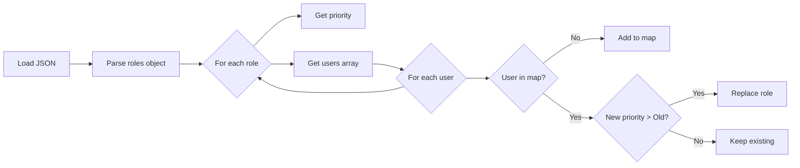

## Overview

The role system maps VRChat users to visual icons based on their display names and role priorities. It uses a JSON-based configuration that can be hosted remotely and updated dynamically.

## JSON Structure

The `userRoles.json` file defines all roles and user assignments:

```json
{
  "version": "1.0.0",
  "lastUpdated": "2025-09-11T15:30:00Z",
  "roles": {
    "leader": {
      "priority": 100,
      "users": [
        "BlauThemce"
      ]
    },
    "secretaries": {
      "priority": 90,
      "users": [
        "SerlesThemce",
        "Mαятιи_MxVr"
      ]
    },
    "maids": {
      "priority": 80,
      "users": [
        "Hana Rose",
        "XMascaritaX",
        "Lanita_UwUr"
      ]
    }
  }
}
```

### JSON Schema

<Accordion title="Field Definitions">
  <ResponseField name="version" type="string">
    Schema version for future compatibility. Currently `"1.0.0"`.
  </ResponseField>
  
  <ResponseField name="lastUpdated" type="string">
    ISO 8601 timestamp of last modification. Used for cache invalidation.
  </ResponseField>
  
  <ResponseField name="roles" type="object" required>
    Dictionary of role definitions, keyed by role name.
    
    <Expandable title="Role Object">
      <ResponseField name="priority" type="number" required>
        Priority value (0-100). Higher values take precedence when a user has multiple roles.
      </ResponseField>
      
      <ResponseField name="users" type="array" required>
        Array of VRChat display names (exact match, case-sensitive).
      </ResponseField>
    </Expandable>
  </ResponseField>
</Accordion>

## Priority System

Priorities determine which icon is shown when a user appears in multiple roles.

### Priority Hierarchy

<Steps>
  <Step title="Highest Priority Wins">
    When processing roles, the system tracks the highest priority for each user:
    
    ```csharp
    if (!userRoleMap.ContainsKey(username) || 
        priority > GetUserRolePriority(username))
    {
        userRoleMap[username] = roleName;
    }
    ```
    
    **Reference:** `UserIconManager.cs:216-220`
  </Step>
  
  <Step title="Priority Values">
    Common priority ranges:
    
    | Priority | Role Type | Example |
    |----------|-----------|----------|
    | 100 | Leadership | Leader, Owner |
    | 90-99 | Management | Secretaries, Admins |
    | 80-89 | Staff (Primary) | Maids, Senior Staff |
    | 70-79 | Staff (Secondary) | Butlers, Guards |
    | 60-69 | Contributors | Collaborators, Helpers |
    | 1-59 | Special Roles | VIPs, Members |
  </Step>
  
  <Step title="Tie Breaking">
    If two roles have the same priority, the last one processed wins. To ensure consistent behavior, use unique priorities for each role.
  </Step>
</Steps>

<Warning>
  Priority values are compared numerically. A role with priority `90` will override a role with priority `80`, even if the user appears in both lists.
</Warning>

## User Mapping Process

The system builds a `userRoleMap` dictionary during JSON processing:



### Implementation Details

<Accordion title="ProcessRolesData() Method">
  ```csharp
  private void ProcessRolesData()
  {
      userRoleMap.Clear();
      
      if (rolesData == null) return;
      
      DataList roleKeys = rolesData.GetKeys();
      
      for (int i = 0; i < roleKeys.Count; i++)
      {
          string roleName = roleKeys[i].String;
          DataToken roleData = rolesData[roleName];
          
          DataDictionary roleDict = roleData.DataDictionary;
          
          if (roleDict.TryGetValue("users", out DataToken usersToken))
          {
              DataList users = usersToken.DataList;
              int priority = GetRolePriority(roleDict);
              
              for (int j = 0; j < users.Count; j++)
              {
                  string username = users[j].String;
                  
                  if (!userRoleMap.ContainsKey(username) || 
                      priority > GetUserRolePriority(username))
                  {
                      userRoleMap[username] = roleName;
                  }
              }
          }
      }
  }
  ```
  
  **Reference:** `UserIconManager.cs:188-226`
</Accordion>

## Display Name Matching

User assignment uses **exact string matching** on VRChat display names:

<CodeGroup>
  ```csharp Player Icon Assignment
  private void UpdatePlayerIcon(VRCPlayerApi player)
  {
      string playerName = player.displayName;
      
      string roleName = null;
      if (userRoleMap.TryGetValue(playerName, out DataToken roleToken))
          roleName = roleToken.String;
      
      if (string.IsNullOrEmpty(roleName))
      {
          RemovePlayerIcon(playerId);
          return;
      }
      
      CreateOrReuseIcon(player, roleName);
  }
  ```
</CodeGroup>

**Reference:** `UserIconManager.cs:269-303`

### Matching Rules

<AccordionGroup>
  <Accordion title="Case Sensitivity">
    Display names are **case-sensitive**. These are treated as different users:
    - `"BlauThemce"`
    - `"blauthemce"`
    - `"BLAUTHEMCE"`
    
    Ensure the JSON exactly matches the display name shown in VRChat.
  </Accordion>
  
  <Accordion title="Special Characters">
    Unicode characters are fully supported:
    ```json
    "users": [
      "Mαятιи_MxVr",
      "クロエChloe",
      "ㄚ ㄖ 尺 ㄩ - 暗い"
    ]
    ```
    
    **Reference:** See `userRoles.json` for real examples with Japanese, Greek, and other Unicode characters.
  </Accordion>
  
  <Accordion title="Whitespace">
    Leading/trailing spaces matter:
    - `"Hana Rose"` ≠ `" Hana Rose"`
    - `"Terry_x"` ≠ `"Terry_x "`
    
    Trim whitespace in your JSON to avoid matching issues.
  </Accordion>
</AccordionGroup>

<Tip>
  To find a player's exact display name, use VRChat's player list or enable debug logging in UserIconManager to see detected names.
</Tip>

## Role Sprite Assignment

Each role name must map to a sprite in the Unity inspector:

### Configuration in Unity

<Steps>
  <Step title="Role Names Array">
    In the UserIconManager inspector, define role names in order:
    ```
    Role Names
    ├─ [0] leader
    ├─ [1] secretaries
    ├─ [2] maids
    ├─ [3] butlers
    └─ [4] guards
    ```
  </Step>
  
  <Step title="Role Sprites Array">
    Assign corresponding sprites in the same order:
    ```
    Role Sprites
    ├─ [0] leader_icon.png
    ├─ [1] secretary_icon.png
    ├─ [2] maid_icon.png
    ├─ [3] butler_icon.png
    └─ [4] guard_icon.png
    ```
  </Step>
  
  <Step title="Sprite Lookup">
    The system matches by index:
    
    ```csharp
    private Sprite GetRoleSprite(string roleName)
    {
        for (int i = 0; i < roleNames.Length && i < roleSprites.Length; i++)
        {
            if (roleNames[i] == roleName && roleSprites[i] != null)
                return roleSprites[i];
        }
        return null;
    }
    ```
    
    **Reference:** `UserIconManager.cs:405-413`
  </Step>
</Steps>

<Warning>
  If a role name in the JSON doesn't match any entry in `roleNames[]`, the user will not receive an icon, even if they're in the role's user list.
</Warning>

## Dynamic Role Updates

Roles are reloaded from the remote JSON every 5 minutes:

```csharp
private const float JSON_UPDATE_INTERVAL = 300f; // 5 minutes
```

**Reference:** `UserIconManager.cs:41`

### Update Behavior

<Tabs>
  <Tab title="User Added">
    When a user is added to a role in the JSON:
    
    1. Next JSON update loads new data (up to 5 min delay)
    2. `ProcessRolesData()` adds user to `userRoleMap`
    3. `UpdatePlayerIcons()` is called automatically
    4. User receives their icon on next update cycle
    
    <Info>
      If batched updates are enabled, there may be an additional delay of up to `updateInterval` seconds while the system processes players.
    </Info>
  </Tab>
  
  <Tab title="User Removed">
    When a user is removed from a role:
    
    1. JSON update detects the change
    2. User is removed from `userRoleMap`
    3. `UpdatePlayerIcon()` finds no role for the user
    4. Icon is removed and returned to pool
    
    ```csharp
    if (string.IsNullOrEmpty(roleName))
    {
        RemovePlayerIcon(playerId);
        return;
    }
    ```
    
    **Reference:** `UserIconManager.cs:279-283`
  </Tab>
  
  <Tab title="Priority Changed">
    If a user's role priority changes:
    
    1. `ProcessRolesData()` recalculates priorities
    2. User may switch to higher priority role
    3. Existing icon is removed
    4. New icon with different sprite is assigned
    
    This happens seamlessly during the normal update cycle.
  </Tab>
</Tabs>

## Multi-Role Handling

Users can appear in multiple role lists, but only one icon is shown:

<Accordion title="Example: User in Multiple Roles">
  ```json
  {
    "roles": {
      "vip": {
        "priority": 50,
        "users": ["Alice"]
      },
      "moderator": {
        "priority": 85,
        "users": ["Alice"]
      },
      "admin": {
        "priority": 95,
        "users": ["Alice"]
      }
    }
  }
  ```
  
  **Result:** Alice receives the "admin" icon (priority 95), as it's the highest.
</Accordion>

### Priority Resolution Logic

```csharp
private int GetUserRolePriority(string username)
{
    if (!userRoleMap.TryGetValue(username, out DataToken roleToken))
        return 0;
        
    string roleName = roleToken.String;
    if (!rolesData.TryGetValue(roleName, out DataToken roleData))
        return 0;
        
    if (roleData.TokenType == TokenType.DataDictionary)
        return GetRolePriority(roleData.DataDictionary);
        
    return 0;
}
```

**Reference:** `UserIconManager.cs:235-248`

## Best Practices

<CardGroup cols={2}>
  <Card title="Use Unique Priorities" icon="ranking-star">
    Assign unique priority values to each role to ensure deterministic behavior:
    
    ```json
    "leader": { "priority": 100 },
    "admin": { "priority": 95 },
    "moderator": { "priority": 90 }
    ```
  </Card>
  
  <Card title="Validate Display Names" icon="spell-check">
    Test in VRChat first:
    
    1. Join your world
    2. Enable debug logs in UserIconManager
    3. Check console for exact display names
    4. Copy names directly into JSON
  </Card>
  
  <Card title="Host JSON Remotely" icon="cloud">
    Use GitHub, Pastebin, or your own server:
    
    - Enables live updates without world restarts
    - Version control for role history
    - Easy collaboration with staff
  </Card>
  
  <Card title="Document Your Roles" icon="file-lines">
    Add comments to your JSON source:
    
    ```json
    // Production roles - Updated 2025-09-11
    {
      "version": "1.0.0",
      // Leadership tier (100)
      "leader": { ... },
      // Management tier (90-99)
      "secretaries": { ... }
    }
    ```
    
    (Remove comments before deployment)
  </Card>
</CardGroup>

## Troubleshooting

<AccordionGroup>
  <Accordion title="User not receiving icon">
    **Checklist:**
    1. Display name matches exactly (case-sensitive)
    2. Role name in JSON matches Unity's `roleNames[]` array
    3. Corresponding sprite is assigned in `roleSprites[]`
    4. User is within `maxIconPool` limit (check pool isn't full)
    5. JSON is loading successfully (check for parse errors)
    
    Enable `enableDebugLogs` in UserIconManager to see detailed assignment info.
  </Accordion>
  
  <Accordion title="Wrong icon showing">
    **Likely causes:**
    - User appears in multiple roles → Check priorities
    - Role name mismatch → Verify `roleNames[]` spelling
    - Sprites assigned in wrong order → Check array indices
    
    Debug with:
    ```csharp
    Debug.Log($"User: {playerName}, Role: {roleName}, Sprite: {roleSprite.name}");
    ```
  </Accordion>
  
  <Accordion title="Icons not updating after JSON change">
    **Possible reasons:**
    - JSON cache: Wait up to 5 minutes for automatic reload
    - Remote URL: Ensure server allows CORS and returns correct MIME type
    - Parse error: Check JSON syntax with a validator
    
    **Manual reload:**
    Call `LoadRolesFromJson()` via U# event or increase update frequency during testing.
  </Accordion>
</AccordionGroup>
